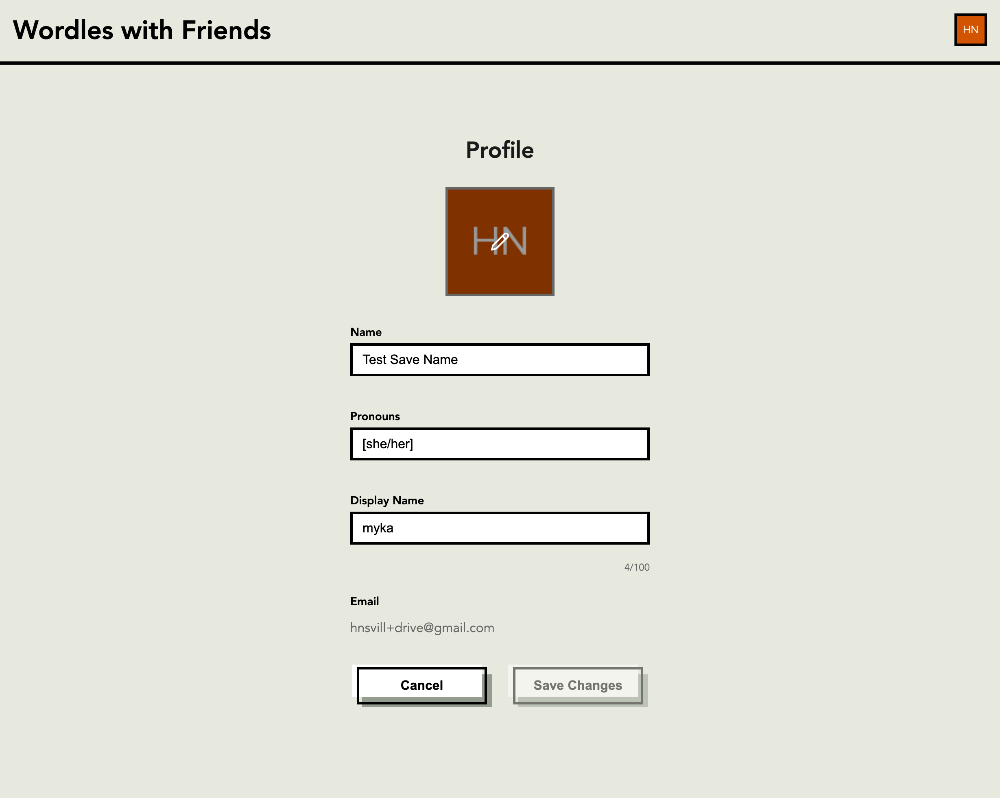
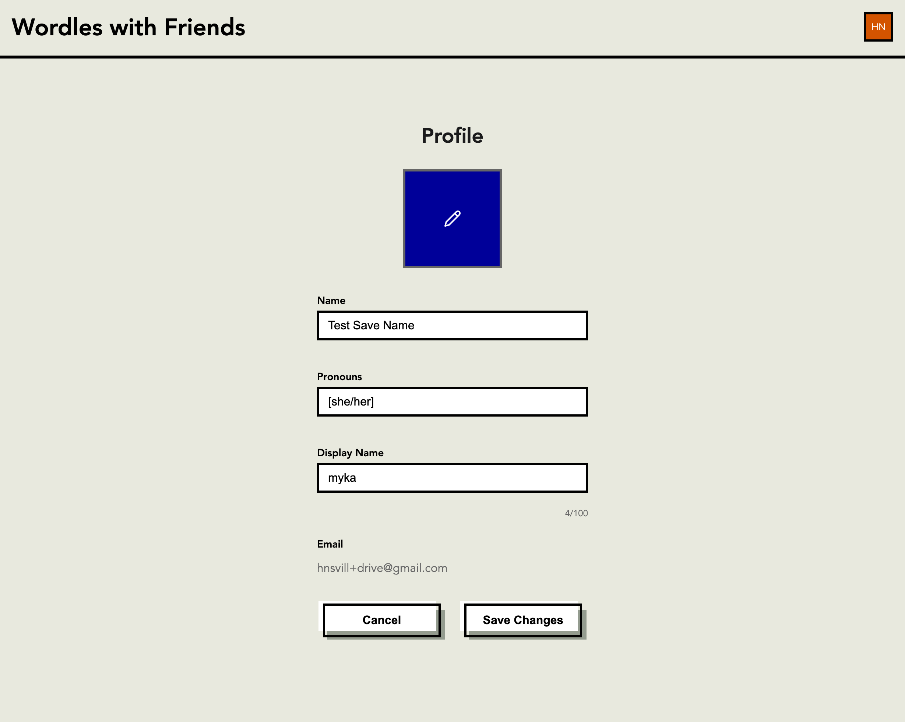
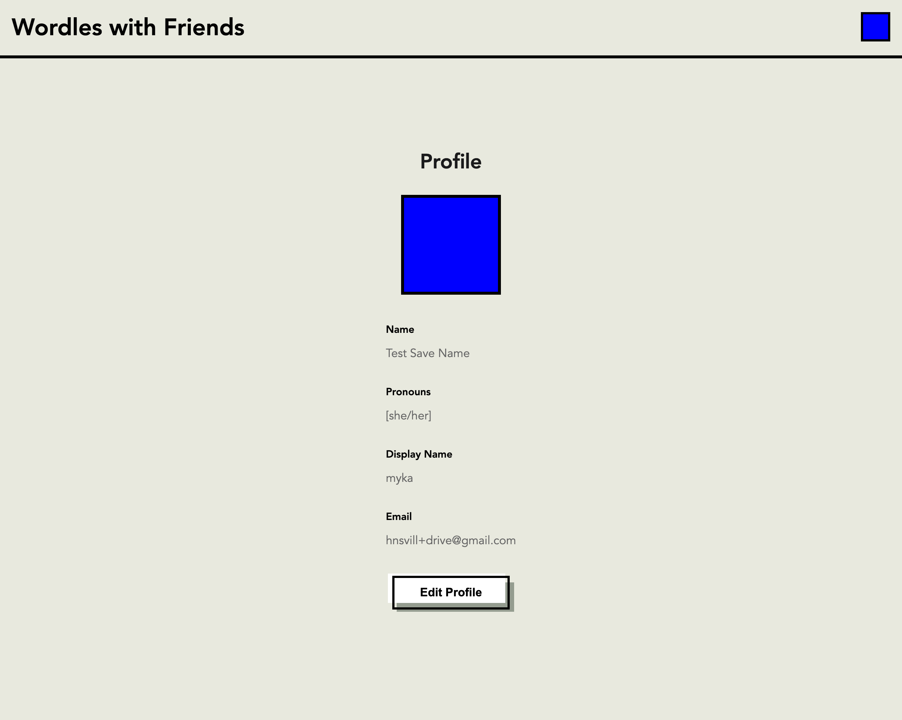
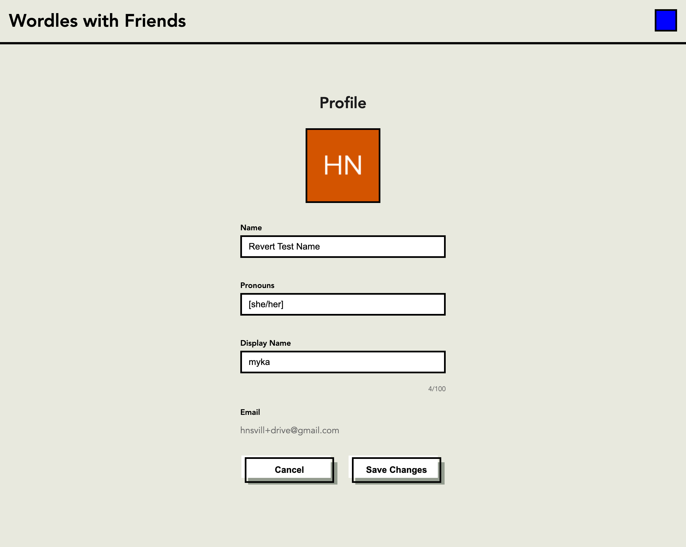
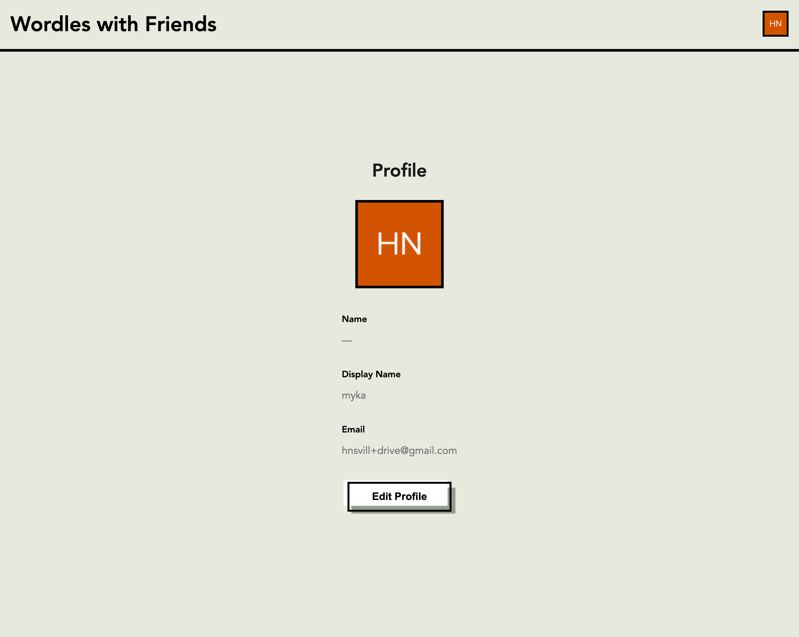

# Profile Enhancements QA Report

**Date:** 2026-02-08
**Branch:** `feat/profile-enhancements` (FE + BE)
**Test Environment:** Local Docker Compose (`compose.sh`)
**Test User:** `hnsvill+drive@gmail.com` (Drivewire tenant)
**Test Tool:** Playwright MCP (Chromium)

---

## Summary

All profile enhancement features were tested end-to-end via Docker Compose with the local backend. After fixing several bugs discovered during QA, all features work correctly.

---

## Test Results

### 1. Edit Mode - Form Layout

**Status: PASS**

Entering edit mode displays the avatar with a pencil overlay, and form fields for Name, Pronouns, Display Name (with character counter), and a read-only Email field.

---

### 2. Avatar Upload

**Status: PASS** (after fixes)

Clicking the avatar in edit mode opens the file picker. After selecting an image (500x500 blue test PNG), the preview updates immediately in the form. The pencil icon overlays the image on hover.

---

### 3. Save Avatar + View Mode

**Status: PASS**

After clicking "Save Changes", the uploaded avatar displays in both the profile view and the header avatar (top-right).

---

### 4. Avatar Persists After Refresh

**Status: PASS**

After a full page refresh, the uploaded avatar loads from S3 via a presigned URL. Both the profile view and header avatar show the uploaded image.

---

### 5. Staged "Revert to Gravatar"

**Status: PASS** (after fixes)

With a custom avatar uploaded, edit mode shows a "Revert to Gravatar" button. Clicking it:

- Changes the avatar preview to the Gravatar (from `user.picture` in the Auth0 token)
- Preserves other unsaved form changes (name was changed to "Revert Test Name")
- Enables the "Save Changes" button
- Does NOT make any API calls (purely local state change)

---

### 6. Cancel Discards All Changes

**Status: PASS**

After staging both a name change and avatar revert, clicking "Cancel":

- Restores the avatar to the original (blue test image)
- Restores the name to the previously saved value ("Test Save Name")
- Returns to view mode with no API calls

---

### 7. Revert + Save Persists Correctly

**Status: PASS**

Reverting the avatar to Gravatar and saving:

- Updates `user_metadata.avatar_url` to `user.picture` on the backend
- Profile view shows the Gravatar image
- Header avatar updates immediately
- Name and pronouns cleared successfully in the same save

---

## Bugs Found and Fixed

### Bug 1: API calls hitting production instead of local backend

**Symptom:** Name updates returned HTTP 200 but changes didn't persist. Network tab showed requests going to `https://api.wordles.dev` instead of `http://localhost:8080`.

**Root Cause:** The FE Dockerfile runs `npm run build` at Docker image build time. Rsbuild inlines `PUBLIC_API_URL` from the `.env` file (which pointed to production). The `docker-compose.yml` set the correct URL as a runtime env var, but Rsbuild only reads env vars at build time.

**Fix:**

- `Dockerfile`: Added `ARG PUBLIC_API_URL` / `ENV PUBLIC_API_URL=$PUBLIC_API_URL` before `RUN npm run build`
- `docker-compose.yml`: Added `args: PUBLIC_API_URL: http://localhost:8080` under frontend `build:` section

### Bug 2: File picker not opening when clicking avatar (Safari)

**Symptom:** Clicking the avatar/pencil icon in edit mode did nothing in Safari. Worked in Chromium (Playwright).

**Root Cause:** The original implementation used `onClick={() => inputRef.current?.click()}` to programmatically trigger the hidden file input. Safari doesn't reliably forward clicks from child elements inside a `<label>` to the associated input, and programmatic `.click()` can be blocked in some contexts.

**Fix (two parts):**

1. Changed the dropzone from `
` to `<label htmlFor="avatar-upload-input">` - native browser label/input association is more reliable than programmatic clicks
2. Added `pointer-events: none` to all child elements inside the label (`img`, pencil overlay, placeholder) - Safari doesn't forward clicks from child elements inside a `<label>` to the associated input, so all clicks must land on the label itself

### Bug 3: "Revert to Gravatar" resetting unsaved form changes

**Symptom:** Clicking "Revert to Gravatar" would reset the name/pronouns fields back to their saved values, losing any unsaved edits.

**Root Cause:** The revert handler was calling the API immediately (`updateUserProfile` + `refreshProfile`), which triggered a re-fetch of profile data and reset all form state via the `useEffect` sync.

**Fix:** Made `handleRevertAvatar` a purely local state change - it only sets `avatarUrl` to `revertPreviewUrl` and clears `pendingAvatarFile`. The actual API call is deferred to the "Save Changes" button, just like other form field edits. Removed the `onRevertAvatar` prop from `ProfileForm`.

### Bug 4: Broken avatar image in edit mode (AvatarUploader)

**Symptom:** No image rendered in the avatar area when in edit mode if the S3 presigned URL had expired.

**Root Cause:** The `AvatarUploader` component had no `onError` handler for failed image loads, unlike the `Avatar` component which had a fallback.

**Fix:** Added `imgError` state with a `FALLBACK_IMAGE` constant (`https://www.gravatar.com/avatar/?d=mp`). When the `` fires `onError`, the display falls back to the Gravatar default. This is purely client-side with no API calls.

### Bug 5: 404 on avatar upload endpoint

**Symptom:** `POST /profile/avatar` returned 404 Not Found.

**Root Cause:** `S3_AVATAR_BUCKET` env var was not set in `docker-compose.yml`, so the backend's S3 service was disabled and the `upload_avatar` endpoint was never registered.

**Fix:**

- `compose.sh`: Added `S3_AVATAR_BUCKET=scorekeeper-avatars` export and AWS credential passthrough via `aws configure export-credentials`
- `docker-compose.yml`: Added `S3_AVATAR_BUCKET`, changed hardcoded AWS creds to env var passthrough for real S3 access

---

## Files Changed (this session)

| File                         | Change                                                                             |
| ---------------------------- | ---------------------------------------------------------------------------------- |
| `fe/.../AvatarUploader.tsx`  | `<label htmlFor>` instead of `
`, image error fallback, pencil overlay |
| `fe/.../AvatarUploader.scss` | `pointer-events: none` on children, pencil overlay styles                          |
| `fe/.../ProfileForm.tsx`     | Staged revert (local state only), removed `onRevertAvatar` prop                    |
| `fe/.../ProfileForm.scss`    | Revert button styling, hover preview with CSS transitions                          |
| `fe/.../ProfilePage.tsx`     | Avatar URL change detection in submit, removed `onRevertAvatar`                    |
| `fe/.../Dockerfile`          | `ARG/ENV PUBLIC_API_URL` for build-time env var                                    |
| `docker-compose.yml`         | Build args for FE, S3 + AWS credential passthrough for BE                          |
| `compose.sh`                 | S3 bucket config, AWS credential export                                            |
